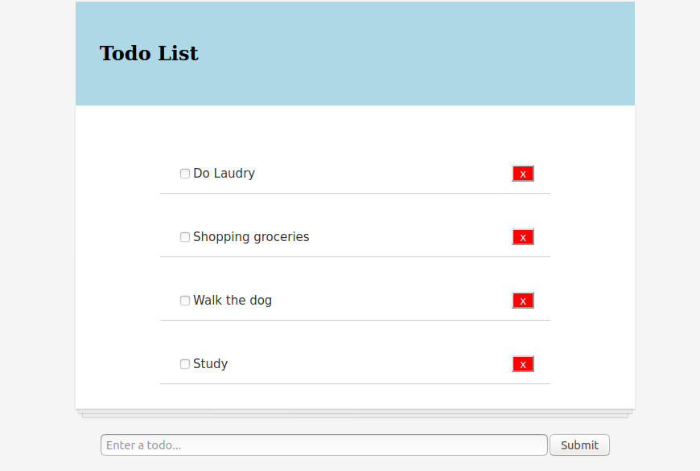

## Todo App

This is a React Todo App that allows the user to have a list of current todos, add new activities to the list, mark them as complete and delete them.

### Techonologies

React

### Packages

Axios 
PropTypes

### In the project directory, you can run:

`npm start`

Runs the app in the development mode. 
Open [http://localhost:3000](http://localhost:3000) to view it in the browser.

The page will reload if you make edits. 
You will also see any lint errors in the console.

### Functionality to improve

Responsiveness needs to be improved for small sreens, as well as style overall.

### Author

Sofia Dionisio

